# Hands-on Network Firewall Workshop

[Workshopのリンク](https://catalog.us-east-1.prod.workshops.aws/workshops/d071f444-e854-4f3f-98c8-025fa0d1de2f/en-US)

## アーキテクチャ

`More specific routing`を使用して Workshop のアーキテクチャを変更。

NAT GW を Firewall Endpoint の外側に配置。

## ルーティング設定
### Public Subnet
| Destination          | Target            | 備考                                                      |
| -------------------- | ----------------- | --------------------------------------------------------- |
| VPCのCIDR            | local             |                                                           |
| Private SubnetのCIDR | Firewall Endpoint | Private Subnet向け通信はFirewall Endpointを通るようにする |
| 0.0.0.0/0            | IGW               |                                                           |

### Firewall Subnet
| Destination | Target     | 備考 |
| ----------- | ---------- | ---- |
| VPCのCIDR   | local      |      |
| 0.0.0.0/0   | NAT Gatway |      |

### Firewall Subnet
| Destination | Target            | 備考                                            |
| ----------- | ----------------- | ----------------------------------------------- |
| VPCのCIDR   | local             |                                                 |
| 0.0.0.0/0   | Firewall Endpoint | 外に出る通信はFirewall Endpointを通るようにする |